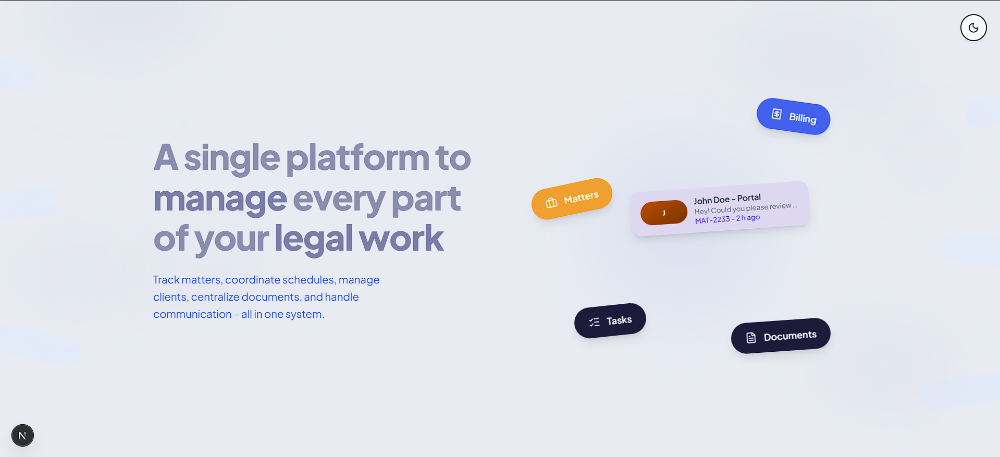
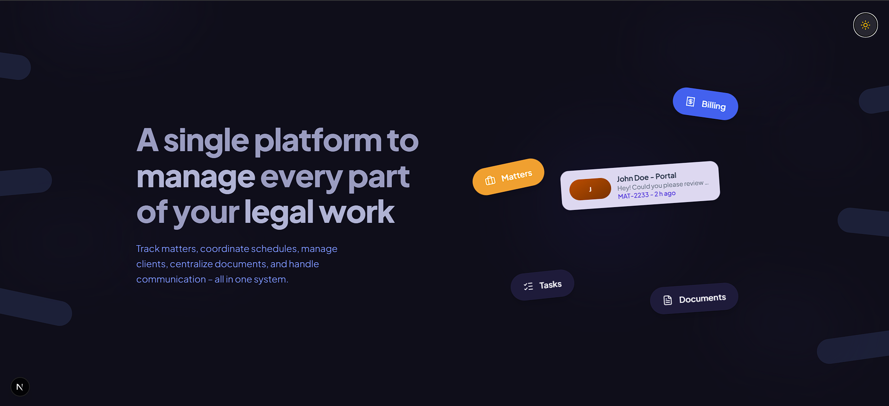

# Praava Legal

A single platform to manage every part of your legal work.

## Screenshots

| Light Mode | Dark Mode |
|:---:|:---:|
|  |  |

## Features

- **Matter Management** — Track and organize legal matters in one place
- **Task Tracking** — Coordinate schedules and manage deadlines
- **Document Management** — Centralize all your legal documents
- **Billing** — Handle invoicing and financial tracking
- **Client Portal** — Communicate with clients seamlessly
- **Dark Mode** — Full dark mode support with smooth transitions

## Tech Stack

- **Next.js 16** — React framework with Turbopack
- **Tailwind CSS v4** — Utility-first styling
- **Lucide React** — Icon library
- **Plus Jakarta Sans** — Typography

## Getting Started

```bash
npm install
npm run dev
```

Open [http://localhost:3000](http://localhost:3000) to view the app.
